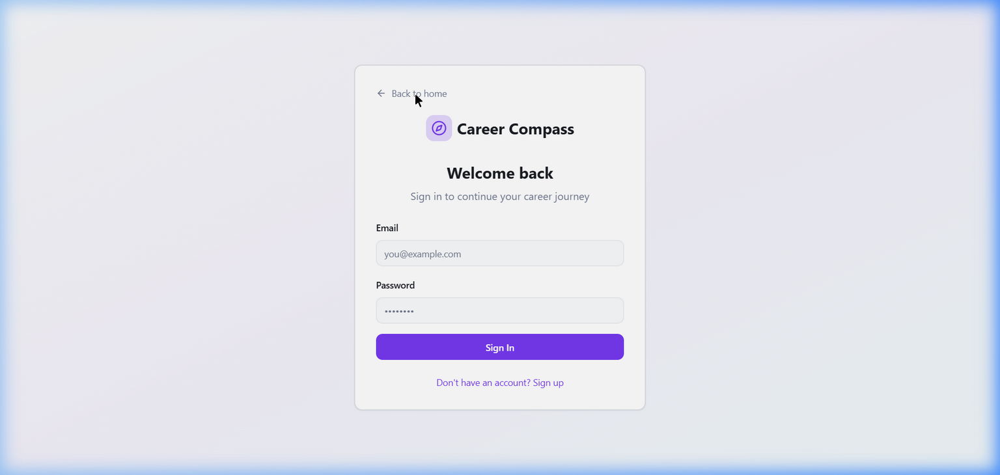

# 🧭 Career Compass — AI-Powered Career Path Recommender

Career Compass is a modern, AI-driven career guidance platform designed to help professionals and students discover their ideal career trajectories. By analyzing skills, interests, and experience, it provides personalized career recommendations and actionable roadmaps.

## 🖼️ App Showcase

| Landing Page | Authentication | Career Results |
| :--- | :--- | :--- |
|  |  |  |

## ✨ Core Features & Descriptions

- **🤖 AI Career Assessment**: A deep-dive interactive evaluation that uses AI logic to map your unique professional profile to industry trends.
- **🎯 Precision Matching**: Advanced scoring algorithms that provide a "Match Percentage" for various high-growth career paths.
- **🗺️ Interactive Roadmaps**: Generates custom learning paths and next steps to bridge the gap between your current skills and your dream job.
- **💎 Premium Glassmorphism UI**: A state-of-the-art interface built with Tailwind CSS v4, featuring smooth transitions and a sleek dark/light theme.
- **🔐 Secure Auth System**: Full user account management powered by Supabase, allowing users to save and track their results over time.

## 🚀 Tech Stack

- **Frontend**: React 19 + Vite
- **Styling**: Tailwind CSS v4 (Modern Design System)
- **Icons**: Lucide React
- **Animations**: Framer Motion & Tailwind Animate
- **Backend**: Supabase (Auth & Database)
- **Routing**: React Router 7

## 🛠️ Getting Started

### Prerequisites
- Node.js (Latest LTS)
- npm or yarn

### Installation

1. **Clone the repository**
   ```bash
   git clone https://github.com/Srivalli-D/career-path-ai.git
   cd career-path-ai
   ```

2. **Install dependencies**
   ```bash
   npm install
   ```

3. **Set up Environment Variables**
   Create a `.env` file in the root directory and add your Supabase credentials:
   ```env
   VITE_SUPABASE_URL=your_supabase_url
   VITE_SUPABASE_ANON_KEY=your_supabase_anon_key
   ```

4. **Run the development server**
   ```bash
   npm run dev
   ```
   The app will be live at `http://localhost:5173`.

## 📦 Deployment

The project is ready for instant deployment. 

1. **Build the project**
   ```bash
   npm run build
   ```
2. **Deploy the `dist` folder** to platforms like Netlify, Vercel, or Surge.

## 📄 License

This project is open-source and available under the [MIT License](LICENSE).

---
*Created with ❤️ by [Srivalli-D](https://github.com/Srivalli-D)*
